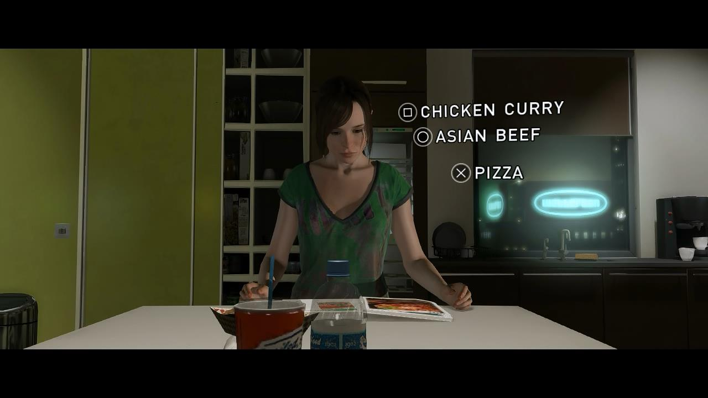

# PEC3_Manovich_Reloaded
Visionando el futuro con las gafas de Manovich: redescubriendo la hibridación

## Introducción
La hibridación de medios consiste, según Manovich, en 

Convivimos con la hibridación de medios todos los días y a todas horas. Por ejemplo, ¿sabías que las plataformas de streaming, como Netflix, surgen de la hibridación de medios? En ellas se fusionan dos grandes medios: la televisión y el cine.

Viendo este ejemplo, podemos entrever la importancia de este fenómeno que da, como resultado, un formato mucho más innovador y que consigue atraer la atención de los consumidores. Así, se puede generar un interés renovado alrededor de cualquier medio ya existente.

Existen numerosos caso de hibridación interesantes y que han tenido resultados más que satisfactorios. Sin embargo, este pequeño estudio se centrará en la hibridación de medios en los formatos culturales y, de forma más específica, en **la hibridación de los videojuegos con otros medios**.

## Hibridación y videojuegos

Según los últimos informes de DFC Intelligence, ***más de 3 mil millones de personas en todo el mundo juegan a videoojuegos en su tiempo libre.***[^1] Esto supone que un 40% de la población mundial juega a videojuegos. Se dice pronto, ¿verdad? Probablemente los videojuegos tengan mucho más impacto en nuestras vidas de lo que pensamos. Sin ir más lejos, está ampliamente demostrado que la gamificación es una de las herramientas más potentes en el ámbito educativo. Ahora que el software domina el mundo, ¿cómo puede impactar en nuestras vidas una experiencia totalmente digital?

Centrándonos en la evolución de los videojuegos, en sus primeros pasos apenas encontrábamos narrativa, sino que estaban realizados de forma muy esquemática. No tenían nada que ver con los videojuegos que se desarrollan actualmente. Por ejemplo, si analizamos el mítico ***PONG*** (Atari, 1972) no tiene ningún tipo de narrativa compleja: hay dos jugadores, representado por líneas verticales, y una pelota, representada por un círculo. La mente humana es capaz de reconocer este esquema y comprender que se está jugando un partido de tenis de forma digital.

>Captura del videojuego *Pong*, uno de los primeros videojuegos desarrollados

Sin embargo, en la mayoría de los videojuegos actuales, encontramos una narrativa mucho más compleja que cuenta con recursos adquiridos completamente del cine. Este es el ejemplo de las cinemáticas, fragmentos de video que se muestran a medida que el jugado avanza en la historia. En estas secuencias el jugador tiene una interacción limitada o nula con el videojuego, ya que lo importante es MOSTRAR un evento importante de la historia.

>Captura del videojuego *Beyond Two Souls*, planos correspondientes a cinemáticas
>incluídas en el propio videojuego

Por tanto, en la actualidad es complicado encontrar un videojuego que no se nutra del cine o de otros medios. Analizaremos, a continuación, dos videojuegos en los que la técnica de hibridación ha funcionado de forma satisfactoria, creando productos digitales interactivos de buena calidad. Hablamos de ***Beyond Two Souls**** y la saga de videojuegos ***Just Dance***. 

### Caso 1: *Beyond Two Souls* (2013)

| FICHA TÉCNICA  |   |
| -- | -- |
| Género | **Aventura Gráfica** |
| Desarrollador | **Quantic Dream** |
| Editor | **Quantic Dream** |
| Distribuidor | **Quantic Dream** |
| Fecha de lanzamiento | **17 Octubre 2013** |

✒️**Sinopsis**: Jodie (Elliot Page) tiene una misteriosa conexión con un extraño ente, Aiden, que posee increíbles poderes. Todas las acciones que tomes como jugador mientras se enfrenta a diferentes desafíos y aventuras, determinarán su historia.

El actor Elliot Page da vida a Jodie, la protaginista de nuestra historia. En este videojuego, se mezcla la interacción del jugador (mediante teclado o mando) que será el que tenga en sus manos el destino de Jodie. Con grandes dosis de CGI e impresionantes gráficos, la inmersión de este videojuego es apabullante.

Haciendo clic sobre la siguiente imagen puedes ver un vídeo de su making off con modelado 3D y animación mediante CGI, técnicas que son posibles gracias a diferentes softwares y que son muy utilizados en cine y videojuegos.

>En Beyond Two Souls se utilizó CGI para el modelado 3d 
>y la animación de personajes. Así se consigue una experiencia
>mucho más realista y mejores gráficos lo que ayuda a la inmersión
>de los jugadores

Beyond Two Souls es, desde mi punto de vista, el ejemplo de perfecto de hibridación entre cine y videojuegos. En él podemos observar una imagen y fotografía propia del más puro cine. De hecho, si abrieras un gameplay en alguna plataforma de streaming (por ejemplo, Youtube) descubrirás que la narrativa es tan sumamente compleja que te parecerá que estás viendo una película de aventura *sci-fy*.

En este punto, citamos a Manovich: ***en los híbridos de medios, las interfaces, técnicas y en última instancia las presuposiciones más básicas de los diversos formatos y tradiciones de medios se unen y dan pie a nuevas gestalts de medios. Es decir, se fusionan para ofrecer una experiencia nueva y coherente, que es distinto a experimentar los elementos uno por uno***[^2]. Aquí Manovich establecía la diferencia entre la hibridación y la multimedia. Como podemos observar, Beyond Two Souls sigue su línea de pensamientos.

La interfaz del juego se fusiona con la imagen, creada a través de modelado 3d y CGI. A su vez, encontramos un guión y una narrativa compleja. La fusión de estos tres factores concluyen en un lenguaje totalmente nuevo y enriquecedor. Para sustentar estos datos, podemos observar la siguiente captura del propio videojuego:

>Captura del videojuego Beyond Two Souls. 
>Observamos un plano medio con un leve contrapicado (técnica de cine), 
>el modelado 3d del actor Elliot Page (a través de CGI) y la interfaz 
>de interacción para los jugadores (toma de decisiones dentro del videojuego).

Como jugadora de Beyond Two Souls, este juego marcó un comienzo para mí en el género de aventura gráfica. Desde mi punto de vista, la aventura gráfica tiene un componente muy importante: la accesibilidad. Hay videojouegos que son bastante complicados y jugarlos requiere de cierta experiencia, estrategia y habilidad. En el caso de las aventuras gráficas, practicamente cualquier jugador (aunque no sea usuario habitual de videojuegos) puede jugar y disfrutar de la aventura sin dificultades extremas añadidas.

### Caso 2: *Just Dance* (2009)

| FICHA TÉCNICA  |   |
| -- | -- |
| Género | **Música, danza** |
| Desarrollador | **Ubisoft París** |
| Plataformas | **Wii (inicialmente)** |
| Distribuidor | **Ubisoft** |
| Fecha de lanzamiento | **17 Noviembre 2009** |

*Analizaremos el concepto en el que se basa toda la saga de Just Dance, aunque la ficha técnica se centra en el primer Just Dance que vio la luz.*

Descripción: Just Dance es el videojuego de música más vendido de la historia. Es un juego basado en la danza que proporciona una experiencia de baile accesible y divertida con una premisa de gamificación: cuanto mejor imite el jugador los pasos de baile, más puntos ganará. Tiene opción de multijugador hasta cuatro personas.

Los efectos visuales de los últimos juegos de Just Dance son un caso de hibridación en sí: las coreografías mezclan la imagen real con la animación y el diseño gráfico en post producción. Bailarines reales realizan los pasos de baile ante grandes paredes verdes que facilitarán, posteriormente, el proceso de añadir fondos 3d para crear escenarios totalmente increíbles.

Por otro lado, los rasgos de los bailarines son practicamente imperceptibles, creando así un tipo de imagen más ***cartoon*** y gamberra que le da al videojuego su característico e inconfundible estilo.

Una de las particulares de Just Dance que más me llama la atención, es que los mandos son esenciales para poder captar e interpretar los movimientos de brazos de los usuarios en la vida real. Actualmente, también se pueden utilizar las capturadoras de imagen de algunas consolas para detectar el móvimiento de los jugadores y poder compararlo con los movimientos que realizan los bailarines en el juego.

Desde mi punto de vista, en Just Dance se produce una hibridación de medios muy interesante, que fusiona la interacción de los jugadores mediante una interfaz (videojuegos), los movimientos reales capturados por dispositivos inhalambricos pero físicos, la animación fusionada con la imagen real y, por supuesto, la música.

[^1]: DLPRIVATESERVER. El informe muestra cuántas personas juegan juegos en todo el mundo. [en línea]. *DLPRIVATESERVER*. [consulta: 14/05/2022]. Disponible en: https://dlprivateserver.com/el-informe-muestra-cuantas-personas-juegan-juegos-en-todo-el-mundo-spoiler-hay-muchos/#:~:text=Seg%C3%BAn%20el%20informe%20de%20DFC,m%C3%B3viles%20en%20paralelo%2C%20por%20ejemplo.

[^2]: MANOVICH, Lev. *El Software toma el mando*. Barcelona: Editorial UOC (Edición en Castellano), 2013. ISBN: 978-84-9064-022-7.
